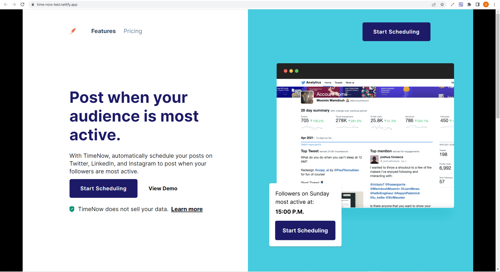

# Codewell - TimeNow landing page solution

This is a solution to the [TimeNow landing page challenge on Codewell](https://www.codewell.cc/challenges/timenow-landing-page--608d9a7d747bad001532bd70). Codewell challenges help you improve your coding skills by building realistic projects.

## Table of contents

- [Overview](#overview)
  - [The challenge](#the-challenge)
  - [Screenshot](#screenshot)
  - [Links](#links)
- [My process](#my-process)
  - [Built with](#built-with)
- [Author](#author)

## Overview

### The challenge

Users should be able to:

- View the optimal layout for the site depending on their device's screen size
- See hover states for all interactive elements on the page
- Switch between monthly and yearly bill payment on the pricing page

### Screenshot

### Links

- Solution URL: [GitHub Repo](https://github.com/oluwadara5000/timenow)
- Live Site URL: [Live Link](https://time-now-test.netlify.app/)

## My process

### Built with

- Semantic HTML5 markup
- CSS custom properties
- Flexbox
- CSS Grid
- Vanilla Javascript

## Author

- Website - [GitHub](https://github.com/oluwadara5000)
- Frontend Mentor - [@oluwadara5000](https://www.frontendmentor.io/profile/oluwadara5000)
- Codewell Profile Name - oluwadara5000
